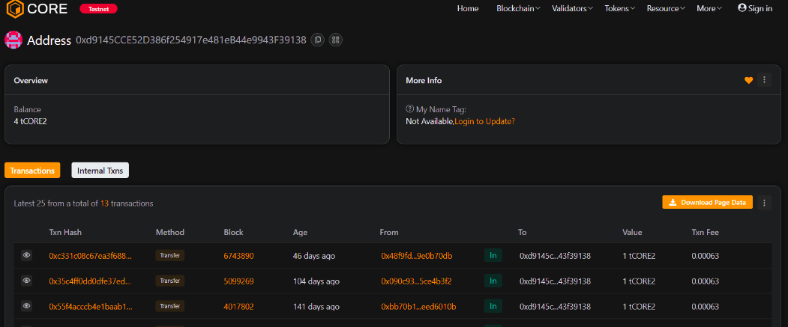

# MetaAnchor

### Project Description
MetaAnchor is a lightweight metadata anchoring system that lets users store a bytes32 content hash on-chain tied to their address. It's designed for low gas cost and straightforward verification of off-chain content (IPFS CIDs, document hashes, etc.).

### Project Vision
Provide a simple, permissionless primitive for tamper-evident metadata anchoring so dApps and users can prove content ownership, timestamps, and integrity without storing large payloads on-chain.

### Key Features
- anchorMeta(bytes32 metaHash) — anchor or update a metadata/content hash for the caller.
- getAnchor(address owner) view — retrieve a user's anchored metadata hash.
- clearAnchor() — remove the caller's anchor.
- Minimal surface area and low gas footprint for easy integration.

### Future Scope
- Support multiple anchors per address with indexing and pagination.
- Add signed anchors (EIP-712) for delegated anchoring and custody transfers.
- Store additional metadata (timestamps, content type) and emit events for off-chain indexing.
- Integrate with IPFS/Arweave tooling and optional access controls or revocation policies.

### Contract address:
0xd9145CCE52D386f254917e481eB44e9943F39138
